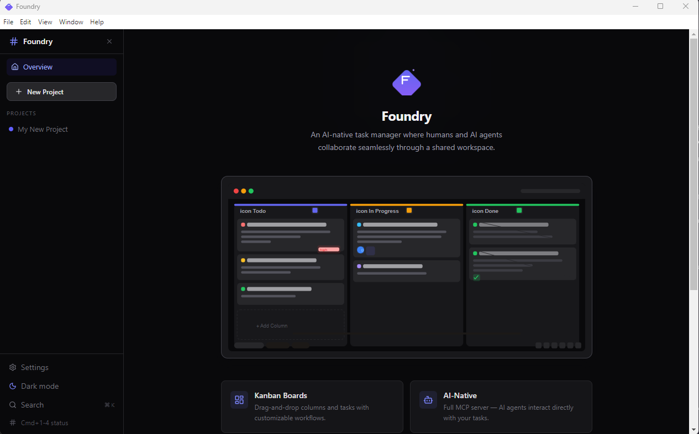
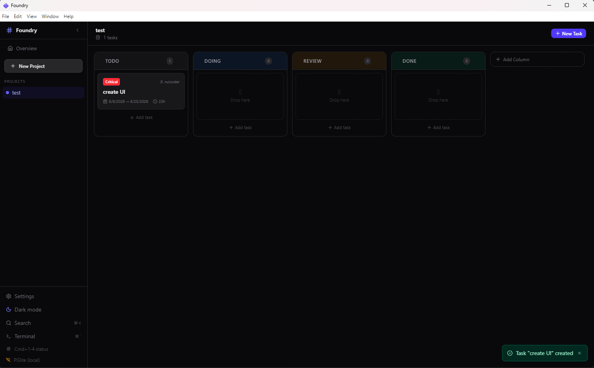
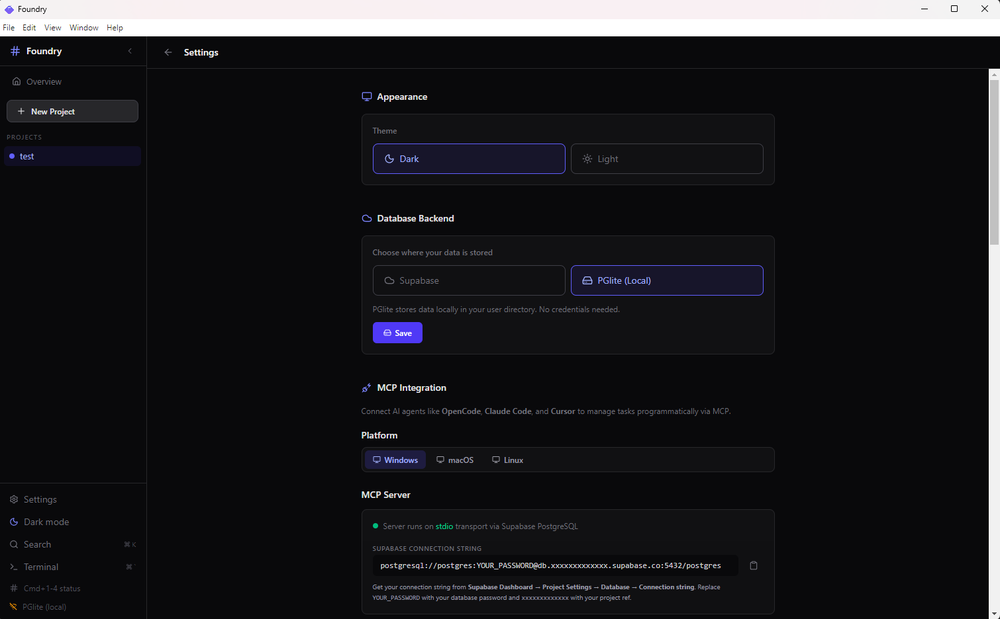

# Foundry — AI-Native Task Manager

An AI-native task manager where **both humans (UI) and AI agents (MCP) are first-class citizens**. Built on SQLite (local-first, persisted to disk).

<div align="center">
  <a href="https://sonht113.github.io/Foundry/" target="_blank">
    
  </a>
  <a href="https://github.com/sonht113/Foundry/releases" target="_blank">
    
  </a>
</div>

## Screenshots

<div align="center">
  
  
  
</div>

## Features

- **Kanban board** with drag-and-drop (dnd-kit) for task management
- **Full MCP server** (28 tools) — AI agents like OpenCode, Claude Code, Cursor, Copilot interact directly with tasks
- **Project management** — create, archive, delete projects with columns and tasks
- **Task tracking** — statuses (todo → doing → review → done), priorities, assignees, dates, tags, notes
- **Desktop app** — cross-platform Electron shell (Windows, macOS, Linux)
- **Offline-first** — SQLite backed, fully offline; no cloud services required

## Monorepo Structure

```
Foundry/
├── apps/
│   ├── electron/          # Electron desktop app (React 19 + Vite + TailwindCSS 4)
│   └── mcp-server/        # MCP server (28 tools, stdio transport)
└── packages/
    ├── database/          # SQLite (sql.js) — raw SQL queries + repositories
    ├── domain/            # Business logic + validators (Zod)
    └── shared/            # Shared types + utilities
```

## Stack

| Layer | Technology |
|-------|-----------|
| Desktop shell | Electron 33 |
| UI | React 19 + TypeScript + Vite 6 + TailwindCSS 4 |
| State | Zustand 5 |
| Database | SQLite (sql.js) — persisted to disk |
| MCP | @modelcontextprotocol/sdk |
| Drag-drop | @dnd-kit/core + @dnd-kit/sortable |
| Packaging | electron-builder |
| Monorepo | pnpm + Turborepo |
| Lint/format | ESLint 9 + Prettier 3 |

## Quick Start

### Prerequisites

- Node.js 18+
- pnpm 10+

### Setup

```bash
# 1. Clone and install
git clone <repo-url>
cd Task_Kanban/Foundry

# 2. Install dependencies
pnpm install

# 3. Start development
pnpm dev          # Electron + Vite dev mode
```

The database file is created automatically at:
- **Windows**: `%APPDATA%\Foundry\foundry.db`
- **macOS**: `~/Library/Application Support/Foundry/foundry.db`
- **Linux**: `~/.local/share/Foundry/foundry.db`

To use a custom path, set the `SQLITE_DATA_DIR` environment variable.

### Environment Variables

| Variable | Description |
|----------|-------------|
| `SQLITE_DATA_DIR` | Custom file path for SQLite database (optional — auto-defaults per OS) |

## Commands

```bash
pnpm dev           # Vite + Electron dev mode
pnpm build         # Production build (Vite + tsc + tsc-alias)
pnpm lint          # ESLint check
pnpm format        # Prettier format
pnpm typecheck     # TypeScript check (NODE_OPTIONS="--max-old-space-size=4096" recommended)
pnpm mcp-server    # Start MCP server standalone
```

### Packaging for Distribution

```bash
# From Foundry/apps/electron/:
npm run pack:win       # Windows NSIS installer
npm run pack:mac       # macOS DMG (requires macOS)
npm run pack:linux     # Linux AppImage (can build from any platform)
```

Output goes to `apps/electron/dist/installers/`.

### CI/CD (GitHub Actions)

Push to `main` or trigger manually via Actions tab — builds artifacts for all 3 platforms:
- **macOS**: `.dmg`
- **Linux**: `.AppImage`
- **Windows**: `.exe` (NSIS installer)

Download artifacts from the workflow run summary page.

## MCP Server

The MCP server exposes **28 tools** via stdio transport:

| Category | Tools |
|----------|-------|
| **Project** | `list_projects`, `get_project`, `create_project`, `update_project`, `delete_project`, `archive_project`, `unarchive_project` |
| **Task** | `list_tasks`, `get_task`, `create_task`, `update_task`, `delete_task`, `move_task`, `search_tasks` |
| **Tag** | `list_tags`, `create_tag`, `delete_tag` |
| **Note** | `list_notes`, `create_note`, `update_note`, `delete_note` |
| **Column** | `list_columns`, `create_column`, `delete_column`, `reorder_columns` |
| **AI** | `analyze_project`, `generate_tasks_from_prompt`, `breakdown_task` |

### Connecting AI Clients

The Foundry MCP server uses **SQLite** (local, persisted to disk) via **stdio transport**.

> **Development vs Installed:** When running from source, the server path is `apps/mcp-server/dist/server.js`.
> When Foundry is installed (via NSIS/DMG/AppImage), the MCP server is bundled at `resources/mcp-server/server.js`
> and dependencies live at `resources/app/node_modules`. Open the app and go to
> **Settings → MCP Server** to see and copy the exact config for your environment.

Build first: `pnpm build`, then configure your MCP client:

**Development (source checkout):**
```json
{
  "mcpServers": {
    "foundry": {
      "command": "node",
      "args": ["/absolute/path/to/Foundry/apps/mcp-server/dist/server.js"]
    }
  }
}
```

Optionally set a custom data directory:
```json
{
  "mcpServers": {
    "foundry": {
      "command": "node",
      "args": ["/absolute/path/to/Foundry/apps/mcp-server/dist/server.js"],
      "env": {
        "SQLITE_DATA_DIR": "/path/to/foundry.db"
      }
    }
  }
}
```

**Installed (Windows example):**
```json
{
  "mcpServers": {
    "foundry": {
      "command": "node",
      "args": [
        "C:\\Program Files\\Foundry\\resources\\mcp-server\\server.js"
      ],
      "env": {
        "NODE_PATH": "C:\\Program Files\\Foundry\\resources\\app\\node_modules"
      }
    }
  }
}
```
> Paths vary by OS and install location. Open **Settings → MCP Server** in the Foundry app to get the exact config.

### Client-Specific Config Paths

| Client | Windows | macOS / Linux | Notes |
|--------|---------|---------------|-------|
| **OpenCode** | `%APPDATA%\opencode\opencode.json` | `~/.config/opencode/opencode.json` | Or `opencode.json` in project root. Uses `mcp` key with `type: "local"` |
| **Claude Code** | `%APPDATA%\Claude Code\settings.json` | `~/.claude/settings.json` | Standard `mcpServers` format |
| **Claude Desktop** | `%APPDATA%\Claude\claude_desktop_config.json` | `~/Library/Application Support/Claude/claude_desktop_config.json` (macOS) / `~/.config/Claude/claude_desktop_config.json` (Linux) | Standard `mcpServers` format |
| **Cursor** | *UI:* Settings → MCP → Add server | Same + `.cursor/mcp.json` per project | Standard `mcpServers` format |
| **GitHub Copilot** | `%USERPROFILE%\.copilot\mcp.json` | `~/.copilot/mcp.json` | Uses `"servers"` key instead of `"mcpServers"` |
| **Windsurf** | `%APPDATA%\windsurf\mcp.json` | `~/.windsurf/mcp.json` | Standard `mcpServers` format |

## Architecture

- **Local-first**: SQLite (sql.js) — data persisted to disk, fully offline, no cloud services required
- **Process model**: Electron main process hosts services; renderer talks via IPC (contextBridge); MCP server runs as stdio child process
- **ID format**: nanoid with prefixes (`proj_`, `task_`, `tag_`, `note_`, `hist_`)
- **Error handling**: Zod validation + custom `AppError` hierarchy + Zustand error states + toast notifications

## Data Model

| Table | Description |
|-------|-------------|
| `projects` | Top-level container with name, description |
| `tasks` | Cards with title, status, priority, dates, assignee |
| `tags` | Case-insensitive labels |
| `task_tags` | Many-to-many join table |
| `notes` | Markdown notes attached to tasks |
| `task_history` | Audit trail for task changes |
| `settings` | User/app configuration key-value pairs |

Task statuses: `todo` → `doing` → `review` → `done`
Priorities: `low`, `medium`, `high`, `critical`

## Roadmap

| Phase | Status | Scope |
|-------|--------|-------|
| Phase 1 | Done | Electron + Project/Task CRUD + dashboard UI |
| Phase 2 | Done | MCP server (28 tools) + SQLite migration |
| Phase 3 | In progress | AI roadmap generator, sprint planner, task breakdown |
| Phase 4 | Planned | Real-time sync, team workspace, multi-agent support |

## License

MIT
